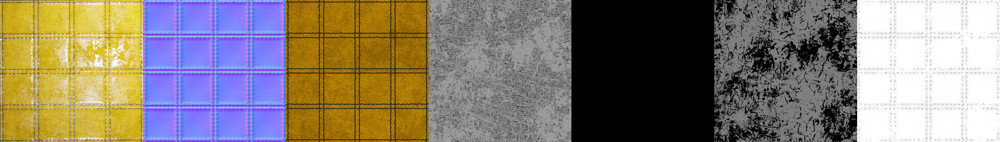

# Metallic-Workflow-SVBRDF
An attempt on constructing a PBR asset library based on metallic workflow for further material capture.

Using blender principled bsdf as current rendering model(GGX + Christensen-Burley).

"Textures" folder contains textures of normals, ao, baseColor, metallic, etc.

"SVBRDF" folder contains integrated BRDF maps for texture capture. There are 7 maps in one image: rendering result, normals, baseColor, roughness, metallic, specular level, ambient occlusion.

